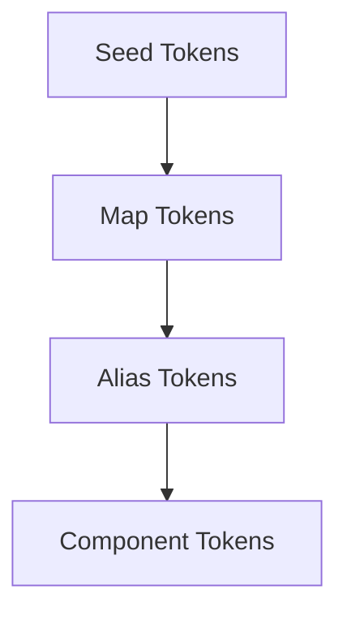

Ant Design's design token system gives you fine-grained control over every visual aspect of the library. Rather than overriding CSS classes, you declare intent at the design level and the library derives the rest automatically. Rather than overriding CSS classes, you declare intent at the design level and the library derives the rest automatically. The system is organised into three hierarchical layers, each one deriving its values from the layer above it.

## The three token layers



<CardGroup cols={2}>
  <Card title="Seed Tokens" icon="seedling">
    The root inputs. You set these on `ConfigProvider`. The algorithm derives everything else from them. There are around 20 seed tokens covering color, typography, spacing, radius, and motion.
  </Card>
  <Card title="Map Tokens" icon="map">
    An intermediate layer. The default algorithm expands each seed color into a 10-step gradient (for example `colorPrimaryBg`, `colorPrimaryBorder`, `colorPrimaryHover`). You normally do not set map tokens directly.
  </Card>
  <Card title="Alias Tokens" icon="tag">
    Semantic, component-facing tokens such as `colorBgContainer` or `colorTextPlaceholder`. They reference map tokens and are the values your own styles should consume if you need to stay theme-aware.
  </Card>
  <Card title="Component Tokens" icon="puzzle">
    Per-component overrides scoped to a single component (for example `Button.colorPrimaryText`). Set via `ConfigProvider`'s `components` prop.
  </Card>
</CardGroup>

## Seed tokens

Seed tokens are the values you customise most often. Pass them under `theme.token` in `ConfigProvider`:

```tsx
import { ConfigProvider } from 'antd';

export default function App() {
  return (
    <ConfigProvider
      theme={{
        token: {
          colorPrimary: '#1677ff',
          colorSuccess: '#52c41a',
          colorWarning: '#faad14',
          colorError: '#ff4d4f',
          colorInfo: '#1677ff',
          borderRadius: 6,
          fontSize: 14,
          controlHeight: 32,
          sizeUnit: 4,
          sizeStep: 4,
          wireframe: false,
          motion: true,
        },
      }}
    >
      <YourApp />
    </ConfigProvider>
  );
}
```

### Key seed tokens

| Token | Type | Default | Description |
|---|---|---|---|
| `colorPrimary` | `string` | `#1677ff` | Brand color. Drives the entire primary color palette. |
| `colorSuccess` | `string` | `#52c41a` | Used by Result, Progress, and similar feedback components. |
| `colorWarning` | `string` | `#faad14` | Used by Alert, Notification, and form validation warnings. |
| `colorError` | `string` | `#ff4d4f` | Used by error states, failed buttons, and form errors. |
| `colorInfo` | `string` | `#1677ff` | Used by Alert, Tag, and Progress info variants. |
| `colorTextBase` | `string` | `#000` | Base seed for deriving the text color gradient. Do not use directly. |
| `colorBgBase` | `string` | `#fff` | Base seed for deriving the background color gradient. Do not use directly. |
| `colorLink` | `string` | — | Hyperlink color. Inherits `colorInfo` by default. |
| `borderRadius` | `number` | `6` | Base border radius for buttons, inputs, cards, etc. |
| `fontSize` | `number` | `14` | Base font size; text gradients derive from this. |
| `controlHeight` | `number` | `32` | Height of standard controls (buttons, inputs). |
| `zIndexBase` | `number` | `0` | Base z-index for components like Affix. |
| `zIndexPopupBase` | `number` | `1000` | Base z-index for overlays such as Modal and Popover. |
| `motion` | `boolean` | `true` | Set to `false` to disable all component transitions. |
| `wireframe` | `boolean` | `false` | Enable wireframe (v4-style) visual mode. |

## Alias tokens

Alias tokens are the stable, semantic tokens your custom styles should reference. They are derived automatically from map tokens and change when you switch between light, dark, or compact mode.

Some frequently used alias tokens:

| Token | Description |
|---|---|
| `colorBgContainer` | Background color of primary containers (Card, Table, Form). |
| `colorBgElevated` | Background for elevated overlays such as Dropdown and Select dropdown. |
| `colorBgLayout` | Background for page-level layout areas. |
| `colorText` | Primary text color (darkest neutral). |
| `colorTextSecondary` | Secondary text; used for labels and secondary information. |
| `colorTextTertiary` | Tertiary text; used for supplementary descriptions. |
| `colorTextPlaceholder` | Placeholder text in inputs. |
| `colorBorder` | Default border color for separators and component edges. |
| `colorBorderSecondary` | Slightly lighter border; same hue as `colorSplit`. |
| `colorSplit` | Transparent separator color used between sections. |
| `colorFillContent` | Background fill for content areas (e.g. code blocks). |
| `colorBgContainerDisabled` | Background of disabled containers. |

## Reading tokens with `theme.useToken`

Use the `theme.useToken` hook to access the resolved token values for the current theme context. This is useful when writing custom styled components that need to stay in sync with theme changes (including dark mode and nested `ConfigProvider`).

```tsx
import { theme } from 'antd';

const { useToken } = theme;

export default function MyComponent() {
  const { token } = useToken();

  return (
    <div
      style={{
        background: token.colorBgContainer,
        borderRadius: token.borderRadius,
        padding: token.paddingMD,
        color: token.colorText,
        borderColor: token.colorBorder,
      }}
    >
      This component adapts to the active theme.
    </div>
  );
}
```

`useToken` returns `{ theme, token, hashId, cssVar }`:

| Property | Description |
|---|---|
| `token` | The complete resolved `GlobalToken` object containing all alias, map, and seed tokens. |
| `theme` | The internal theme instance (rarely needed directly). |
| `hashId` | The CSS scope hash for the current theme (used internally by CSS-in-JS). |
| `cssVar` | CSS variable configuration if CSS variable mode is enabled. |

## Built-in algorithm presets

Ant Design ships three algorithm presets that you can pass to `theme.algorithm`:

```tsx
import { ConfigProvider, theme } from 'antd';

// Default (light) mode
<ConfigProvider theme={{ algorithm: theme.defaultAlgorithm }}>

// Dark mode
<ConfigProvider theme={{ algorithm: theme.darkAlgorithm }}>

// Compact mode (reduces sizeStep from 4 to 2)
<ConfigProvider theme={{ algorithm: theme.compactAlgorithm }}>

// Combine: dark + compact
<ConfigProvider theme={{ algorithm: [theme.darkAlgorithm, theme.compactAlgorithm] }}>
```

<Tip>
  You can also call `theme.getDesignToken(config)` outside a React component to compute the full token set programmatically, which is useful for generating static CSS or for design tooling integrations.
</Tip>
